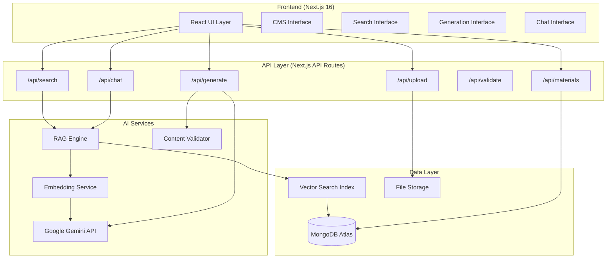
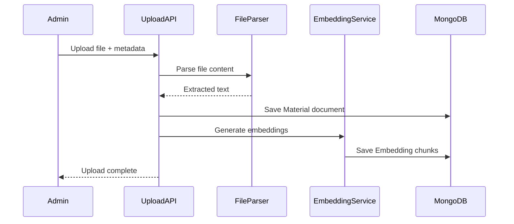
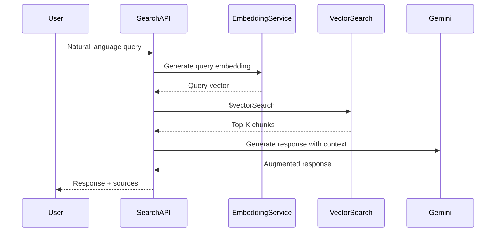
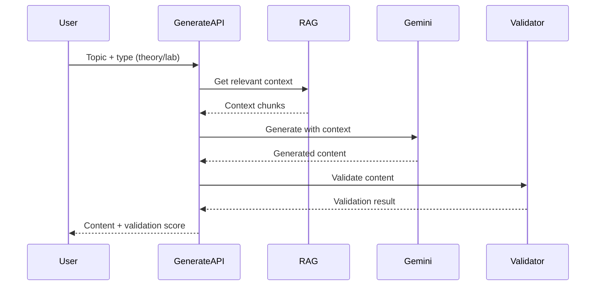
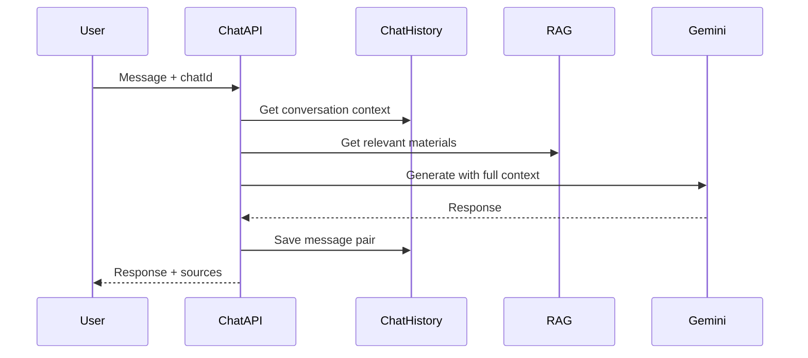

# 🎓 Skooly - AI-Powered Supplementary Learning Platform

## System Architecture Document

---

## 🎯 Project Vision

An AI-powered supplementary learning platform for university courses that organizes content, enables intelligent RAG-based retrieval, generates validated learning materials, and provides a conversational interface.

---

## 📐 High-Level Architecture



---

## 📁 Project Structure

```
skooly-bcf-hackathon/
├── app/
│   ├── (routes)/
│   │   ├── dashboard/page.jsx       # Main dashboard
│   │   ├── materials/
│   │   │   ├── page.jsx             # Browse materials
│   │   │   └── [id]/page.jsx        # View material
│   │   ├── search/page.jsx          # Semantic search
│   │   ├── generate/page.jsx        # AI generation
│   │   └── chat/page.jsx            # Chat interface
│   ├── admin/
│   │   ├── page.jsx                 # Admin dashboard
│   │   └── upload/page.jsx          # Upload materials
│   ├── api/
│   │   ├── materials/route.js       # CRUD materials
│   │   ├── upload/route.js          # File upload + embedding
│   │   ├── search/route.js          # RAG semantic search
│   │   ├── generate/route.js        # AI content generation
│   │   ├── validate/route.js        # Content validation
│   │   └── chat/route.js            # Conversational AI
│   └── components/
│       ├── materials/               # Material components
│       ├── search/                  # Search components
│       ├── generate/                # Generation components
│       └── chat/                    # Chat components
├── lib/
│   ├── ai/
│   │   ├── gemini.js               # Gemini client setup
│   │   ├── embeddings.js           # Embedding generation
│   │   ├── rag.js                  # RAG implementation
│   │   ├── generate.js             # Content generation
│   │   ├── validate.js             # Validation logic
│   │   └── chat.js                 # Chat with memory
│   ├── models/
│   │   ├── Material.js             # Course materials
│   │   ├── Embedding.js            # Vector embeddings
│   │   └── ChatHistory.js          # Chat sessions
│   ├── parsers/
│   │   └── fileParser.js           # PDF, DOCX, code parsing
│   └── mongodb/
│       └── mongoose.js             # DB connection
└── public/
    └── uploads/                    # Uploaded files
```

---

## 🗄️ Database Schema

### Materials Collection

```javascript
{
  _id: ObjectId,
  title: String,                    // "Database Normalization"
  description: String,              // Brief description
  category: "theory" | "lab",       // Course component
  type: "lecture" | "pdf" | "code" | "notes" | "reference",
  topic: String,                    // Topic/chapter
  week: Number,                     // Week number (1-15)
  tags: [String],                   // ["sql", "normalization", "3nf"]
  filePath: String,                 // Local file path
  fileUrl: String,                  // Public URL
  mimeType: String,                 // "application/pdf"
  content: String,                  // Extracted text content
  uploadedBy: String,               // Clerk userId
  createdAt: Date,
  updatedAt: Date
}
```

### Embeddings Collection (Vector Store)

```javascript
{
  _id: ObjectId,
  materialId: ObjectId,             // Reference to material
  chunkIndex: Number,               // Chunk position
  content: String,                  // Text chunk (~500 tokens)
  embedding: [Number],              // 768-dim vector (Gemini)
  metadata: {
    title: String,
    category: String,
    topic: String,
    type: String
  },
  createdAt: Date
}
```

### ChatHistory Collection

```javascript
{
  _id: ObjectId,
  userId: String,                   // Clerk userId
  title: String,                    // Auto-generated title
  messages: [{
    role: "user" | "assistant",
    content: String,
    sources: [ObjectId],            // Referenced materials
    timestamp: Date
  }],
  createdAt: Date,
  updatedAt: Date
}
```

---

## 🔄 Core Data Flows

### 1. Content Upload Flow



### 2. RAG Search Flow



### 3. Content Generation Flow



### 4. Chat Flow



---

## 🤖 AI Components

### Gemini Configuration

```javascript
// lib/ai/gemini.js
import { GoogleGenerativeAI } from "@google/generative-ai";

const genAI = new GoogleGenerativeAI(process.env.GOOGLE_API_KEY);

// For chat and generation
export const model = genAI.getGenerativeModel({ 
  model: "gemini-1.5-flash"
});

// For embeddings
export const embeddingModel = genAI.getGenerativeModel({
  model: "text-embedding-004"
});
```

### RAG Implementation

```javascript
// lib/ai/rag.js
export async function semanticSearch(query, options = {}) {
  const { limit = 5, category = null } = options;
  
  // 1. Generate query embedding
  const queryEmbedding = await generateEmbedding(query);
  
  // 2. Vector search in MongoDB Atlas
  const pipeline = [
    {
      $vectorSearch: {
        index: "embedding_index",
        path: "embedding",
        queryVector: queryEmbedding,
        numCandidates: 100,
        limit: limit,
        filter: category ? { "metadata.category": category } : {}
      }
    },
    {
      $project: {
        content: 1,
        metadata: 1,
        score: { $meta: "vectorSearchScore" }
      }
    }
  ];
  
  return await Embedding.aggregate(pipeline);
}
```

### Content Validation

```javascript
// lib/ai/validate.js
export async function validateContent(content, type) {
  const checks = {
    theory: [
      checkFactualAccuracy,    // Verify against sources
      checkCoherence,          // Logical flow
      checkCompleteness        // Coverage
    ],
    lab: [
      checkSyntax,             // Code linting
      checkExecution,          // Run tests if possible
      checkRelevance           // Match to topic
    ]
  };
  
  const results = await Promise.all(
    checks[type].map(check => check(content))
  );
  
  return {
    valid: results.every(r => r.passed),
    score: calculateScore(results),
    issues: results.filter(r => !r.passed)
  };
}
```

---

## 🔌 API Endpoints

| Endpoint | Method | Description |
|----------|--------|-------------|
| `/api/materials` | GET | List all materials (with filters) |
| `/api/materials` | POST | Create material (admin only) |
| `/api/materials/[id]` | GET | Get material by ID |
| `/api/materials/[id]` | PUT | Update material |
| `/api/materials/[id]` | DELETE | Delete material |
| `/api/upload` | POST | Upload file + generate embeddings |
| `/api/search` | POST | RAG semantic search |
| `/api/generate` | POST | Generate learning materials |
| `/api/validate` | POST | Validate generated content |
| `/api/chat` | POST | Chat with AI (streaming) |
| `/api/chat/history` | GET | Get chat history |

---

## 🎨 UI Components

### Core Pages

| Page | Route | Description |
|------|-------|-------------|
| Dashboard | `/dashboard` | Overview, quick actions |
| Materials | `/materials` | Browse course content |
| Search | `/search` | Semantic search interface |
| Generate | `/generate` | AI content generation |
| Chat | `/chat` | Conversational interface |
| Admin Upload | `/admin/upload` | Upload materials |

### Component Library (Shadcn UI)

- `Button`, `Card`, `Input`, `Textarea`
- `Tabs`, `Dialog`, `Dropdown`
- `ScrollArea`, `Skeleton`
- `Avatar`, `Badge`, `Progress`

---

## 🔐 Environment Variables

```env
# Clerk Authentication
NEXT_PUBLIC_CLERK_PUBLISHABLE_KEY=pk_...
CLERK_SECRET_KEY=sk_...

# MongoDB Atlas
MONGODB_URI=mongodb+srv://...

# Google Gemini AI
GOOGLE_API_KEY=AIza...

# File Upload
UPLOAD_DIR=./public/uploads
MAX_FILE_SIZE=10485760
```

---

## 📊 MongoDB Atlas Vector Search Index

Create this index on the `embeddings` collection:

**Index Name:** `embedding_index`

```json
{
  "mappings": {
    "dynamic": true,
    "fields": {
      "embedding": {
        "type": "knnVector",
        "dimensions": 768,
        "similarity": "cosine"
      },
      "content": {
        "type": "string"
      },
      "metadata": {
        "type": "document",
        "dynamic": true
      }
    }
  }
}
```

---

## ⏰ Implementation Timeline (7 Hours)

| Phase | Time | Deliverables |
|-------|------|--------------|
| **Phase 1** | 0:00-1:00 | Dependencies, Models, DB Connection, Gemini Setup |
| **Phase 2** | 1:00-2:30 | File Upload, Material CRUD, File Parsing, Admin UI |
| **Phase 3** | 2:30-4:00 | Embedding Generation, Vector Search, RAG, Search UI |
| **Phase 4** | 4:00-5:30 | Content Generation (Theory/Lab), Validation, Gen UI |
| **Phase 5** | 5:30-6:30 | Chat with Memory, Streaming, Chat UI |
| **Phase 6** | 6:30-7:00 | Polish, Demo Data, Testing |

---

## 🎁 Bonus Features (Time Permitting)

### 1. Handwritten Notes Digitization

- OCR using Gemini Vision API
- Convert to structured markdown/LaTeX

### 2. Content-to-Video Generation

- Text-to-speech summary
- Visual slide generation

### 3. Community + Bot Support

- Discussion threads per material
- Auto-reply bot using RAG

---

## 🧪 Testing Checklist

- [ ] Upload PDF → Verify embedding creation
- [ ] Search query → Get relevant results with sources
- [ ] Generate theory → Receive structured notes
- [ ] Generate code → Receive syntactically correct code
- [ ] Chat → Maintain conversation context
- [ ] Validate → Get accuracy scores

---

## 🚀 Quick Start

```bash
# 1. Install dependencies
npm install

# 2. Add dependencies for AI & parsing
npm install @google/generative-ai pdf-parse mammoth uuid

# 3. Create .env.local with credentials

# 4. Start development
npm run dev
```
